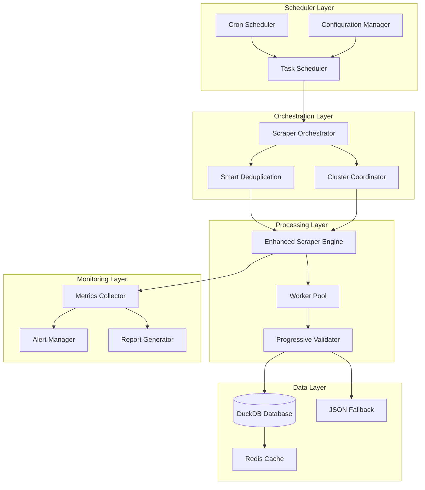
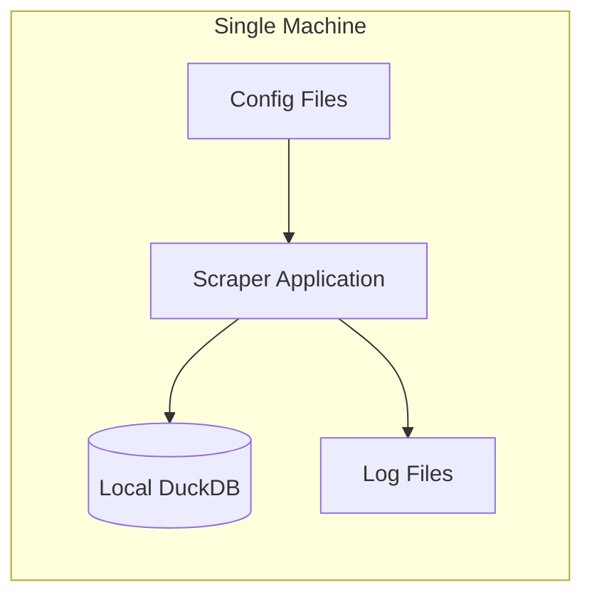
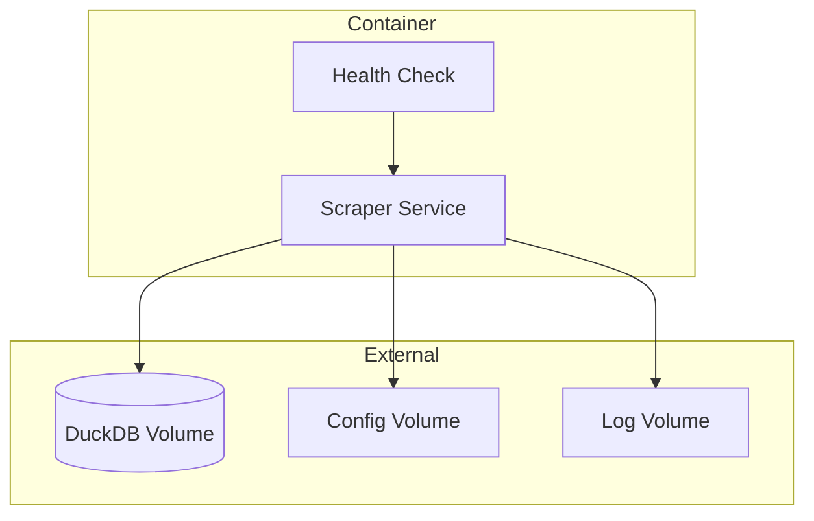
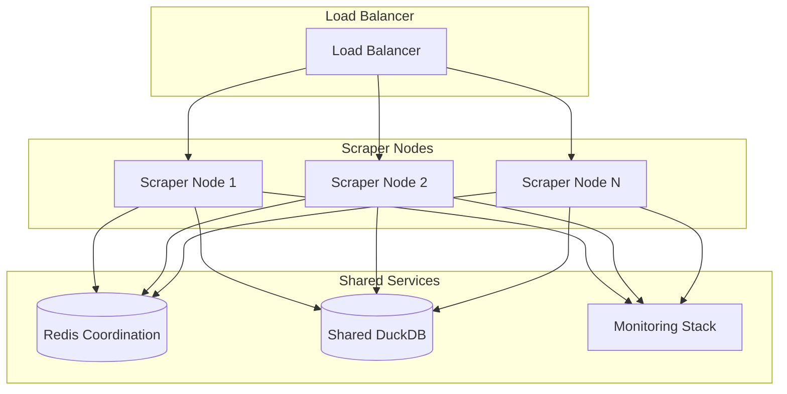

# Design Document

## Overview

The Daily Scraper Automation system transforms the existing manual Oikotie scraper into a production-ready, intelligent automation platform. The design leverages the current DuckDB-based architecture while adding scheduling, smart deduplication, deployment flexibility, and comprehensive monitoring.

The system follows a microservices-inspired architecture that can be deployed as a single application, containerized service, or distributed cluster, while maintaining the established development standards and integrating seamlessly with the existing OSM building footprint infrastructure.

## Architecture

### High-Level System Architecture



### Deployment Architecture Options

#### Option 1: Standalone Application


#### Option 2: Container Deployment


#### Option 3: Cluster Deployment


## Components and Interfaces

### 1. Enhanced Scraper Orchestrator

**Purpose**: Central coordination of scraping operations with smart deduplication

**Key Interfaces**:
```python
class EnhancedScraperOrchestrator:
    def __init__(self, config: ScraperConfig, db_manager: DatabaseManager):
        pass
    
    async def run_daily_scrape(self) -> ScrapingResult:
        """Execute daily scraping with smart deduplication"""
        pass
    
    def get_stale_listings(self, staleness_hours: int = 24) -> List[str]:
        """Identify listings that need re-scraping"""
        pass
    
    def should_skip_listing(self, url: str) -> bool:
        """Determine if listing should be skipped"""
        pass
    
    def coordinate_with_cluster(self) -> WorkDistribution:
        """Coordinate work distribution in cluster mode"""
        pass
```

**Smart Deduplication Logic**:
- Query database for existing listings with timestamps
- Calculate staleness based on configurable threshold
- Prioritize new listings and stale data
- Skip recently processed listings
- Handle failed URLs with exponential backoff

### 2. Deployment Manager

**Purpose**: Handle different deployment scenarios and environment adaptation

**Key Interfaces**:
```python
class DeploymentManager:
    def detect_environment(self) -> DeploymentType:
        """Detect deployment environment (standalone, container, cluster)"""
        pass
    
    def configure_for_environment(self, env_type: DeploymentType) -> Config:
        """Adapt configuration for deployment environment"""
        pass
    
    def setup_health_checks(self) -> HealthCheckEndpoint:
        """Configure health check endpoints"""
        pass
    
    def setup_cluster_coordination(self) -> ClusterCoordinator:
        """Setup distributed coordination if needed"""
        pass
```

**Environment Detection**:
- Check for container environment variables
- Detect cluster coordination services (Redis, etcd)
- Adapt browser automation (headless vs GUI)
- Configure database connections (local vs remote)

### 3. Status Reporter

**Purpose**: Generate comprehensive status reports and alerts

**Key Interfaces**:
```python
class StatusReporter:
    def __init__(self, metrics_collector: MetricsCollector):
        pass
    
    def generate_daily_report(self, execution_result: ScrapingResult) -> Report:
        """Generate comprehensive daily status report"""
        pass
    
    def send_alerts(self, alert_conditions: List[AlertCondition]) -> None:
        """Send alerts via configured channels"""
        pass
    
    def export_metrics(self, format: ReportFormat) -> str:
        """Export metrics in various formats"""
        pass
    
    def track_execution_history(self, result: ScrapingResult) -> None:
        """Maintain historical execution data"""
        pass
```

**Report Components**:
- Execution summary (duration, listings processed, errors)
- Per-city breakdown and statistics
- Data quality metrics and validation results
- Performance metrics (memory, CPU, network)
- Error categorization and troubleshooting info
- Historical trends and comparisons

### 4. Enhanced Database Manager

**Purpose**: Extend existing DatabaseManager with automation-specific features

**Key Interfaces**:
```python
class EnhancedDatabaseManager(DatabaseManager):
    def get_stale_listings(self, staleness_threshold: timedelta) -> List[ListingRecord]:
        """Get listings that need re-scraping"""
        pass
    
    def upsert_with_deduplication(self, listings: List[Listing]) -> UpsertResult:
        """Insert or update listings with smart deduplication"""
        pass
    
    def track_execution_metadata(self, execution_id: str, metadata: ExecutionMetadata) -> None:
        """Track scraping execution metadata"""
        pass
    
    def get_data_quality_metrics(self) -> DataQualityReport:
        """Generate data quality assessment"""
        pass
    
    def cleanup_old_data(self, retention_policy: RetentionPolicy) -> CleanupResult:
        """Clean up old data based on retention policy"""
        pass
```

### 5. Configuration Manager

**Purpose**: Handle flexible configuration across deployment scenarios

**Key Interfaces**:
```python
class ConfigurationManager:
    def load_config(self, config_sources: List[ConfigSource]) -> ScraperConfig:
        """Load configuration from multiple sources"""
        pass
    
    def validate_config(self, config: ScraperConfig) -> ValidationResult:
        """Validate configuration completeness and correctness"""
        pass
    
    def get_environment_overrides(self) -> Dict[str, Any]:
        """Get environment-specific configuration overrides"""
        pass
    
    def watch_config_changes(self) -> ConfigWatcher:
        """Watch for configuration changes in runtime"""
        pass
```

**Configuration Hierarchy**:
1. Default configuration (embedded in code)
2. Configuration files (JSON/YAML)
3. Environment variables
4. Command-line arguments
5. Runtime overrides

### 6. Cluster Coordinator

**Purpose**: Coordinate work distribution in cluster deployments

**Key Interfaces**:
```python
class ClusterCoordinator:
    def __init__(self, redis_client: Redis):
        pass
    
    def acquire_work_lock(self, work_id: str, ttl: int) -> bool:
        """Acquire distributed lock for work item"""
        pass
    
    def distribute_work(self, work_items: List[WorkItem]) -> WorkDistribution:
        """Distribute work across cluster nodes"""
        pass
    
    def report_node_health(self, node_id: str, health_status: HealthStatus) -> None:
        """Report node health to cluster"""
        pass
    
    def coordinate_shutdown(self) -> None:
        """Coordinate graceful shutdown across cluster"""
        pass
```

## Data Models

### Enhanced Listing Schema

```sql
-- Extend existing listings table with automation metadata
ALTER TABLE listings ADD COLUMN IF NOT EXISTS execution_id VARCHAR(50);
ALTER TABLE listings ADD COLUMN IF NOT EXISTS last_check_ts TIMESTAMP;
ALTER TABLE listings ADD COLUMN IF NOT EXISTS check_count INTEGER DEFAULT 0;
ALTER TABLE listings ADD COLUMN IF NOT EXISTS last_error TEXT;
ALTER TABLE listings ADD COLUMN IF NOT EXISTS retry_count INTEGER DEFAULT 0;
ALTER TABLE listings ADD COLUMN IF NOT EXISTS data_quality_score REAL;
```

### Execution Tracking Schema

```sql
-- Track scraping execution metadata
CREATE TABLE IF NOT EXISTS scraping_executions (
    execution_id VARCHAR(50) PRIMARY KEY,
    started_at TIMESTAMP NOT NULL,
    completed_at TIMESTAMP,
    status VARCHAR(20) NOT NULL, -- 'running', 'completed', 'failed'
    city VARCHAR(50) NOT NULL,
    listings_processed INTEGER DEFAULT 0,
    listings_new INTEGER DEFAULT 0,
    listings_updated INTEGER DEFAULT 0,
    listings_skipped INTEGER DEFAULT 0,
    listings_failed INTEGER DEFAULT 0,
    execution_time_seconds INTEGER,
    memory_usage_mb INTEGER,
    error_summary TEXT,
    node_id VARCHAR(50), -- for cluster deployments
    configuration_hash VARCHAR(64),
    created_at TIMESTAMP DEFAULT CURRENT_TIMESTAMP
);
```

### Alert Configuration Schema

```sql
-- Configure alerting rules and channels
CREATE TABLE IF NOT EXISTS alert_configurations (
    id SERIAL PRIMARY KEY,
    alert_name VARCHAR(100) NOT NULL,
    condition_type VARCHAR(50) NOT NULL, -- 'error_rate', 'execution_time', 'data_quality'
    threshold_value REAL NOT NULL,
    comparison_operator VARCHAR(10) NOT NULL, -- '>', '<', '>=', '<=', '=='
    alert_channels JSON NOT NULL, -- ['email', 'slack', 'webhook']
    enabled BOOLEAN DEFAULT TRUE,
    created_at TIMESTAMP DEFAULT CURRENT_TIMESTAMP
);
```

## Error Handling

### Error Categories and Responses

1. **Network Errors**
   - Retry with exponential backoff
   - Switch to backup network configuration
   - Alert after consecutive failures

2. **Parsing Errors**
   - Log detailed error information
   - Skip problematic listings
   - Alert on high error rates

3. **Database Errors**
   - Use JSON fallback storage
   - Attempt database recovery
   - Alert immediately on connection loss

4. **Resource Errors**
   - Monitor memory and disk usage
   - Implement graceful degradation
   - Alert on resource exhaustion

5. **Configuration Errors**
   - Validate configuration on startup
   - Provide detailed error messages
   - Prevent startup with invalid config

### Error Recovery Strategies

```python
class ErrorRecoveryManager:
    def handle_network_error(self, error: NetworkError, context: ScrapingContext) -> RecoveryAction:
        """Handle network-related errors with appropriate recovery"""
        if error.is_temporary():
            return RecoveryAction.RETRY_WITH_BACKOFF
        elif error.is_rate_limit():
            return RecoveryAction.DELAY_AND_RETRY
        else:
            return RecoveryAction.SKIP_AND_ALERT
    
    def handle_database_error(self, error: DatabaseError, data: Any) -> RecoveryAction:
        """Handle database errors with fallback storage"""
        self.fallback_storage.store(data)
        if error.is_connection_error():
            return RecoveryAction.ATTEMPT_RECONNECTION
        else:
            return RecoveryAction.CONTINUE_WITH_FALLBACK
```

## Testing Strategy

### Progressive Validation Integration

Following the established progressive validation strategy:

1. **Step 1: Small Scale Testing (10-20 listings)**
   - Test automation logic with minimal data
   - Validate smart deduplication
   - Verify deployment configuration

2. **Step 2: Medium Scale Testing (100-500 listings)**
   - Test performance under moderate load
   - Validate cluster coordination (if applicable)
   - Test error handling and recovery

3. **Step 3: Full Scale Testing (Production dataset)**
   - Validate production performance
   - Test complete automation workflow
   - Verify monitoring and alerting

### Test Categories

1. **Unit Tests**
   - Smart deduplication logic
   - Configuration management
   - Error handling mechanisms
   - Database operations

2. **Integration Tests**
   - End-to-end scraping workflow
   - Database integration
   - External service integration
   - Deployment scenarios

3. **Performance Tests**
   - Load testing with large datasets
   - Memory usage validation
   - Concurrent execution testing
   - Resource consumption monitoring

4. **Deployment Tests**
   - Container deployment validation
   - Cluster coordination testing
   - Configuration management testing
   - Health check validation

### Bug Prevention Tests

```python
def test_smart_deduplication_edge_cases():
    """Test edge cases in smart deduplication logic"""
    # Test with empty database
    # Test with corrupted timestamps
    # Test with concurrent access
    # Test with network failures during check
    pass

def test_cluster_coordination_failures():
    """Test cluster coordination failure scenarios"""
    # Test Redis connection loss
    # Test split-brain scenarios
    # Test node failure recovery
    # Test work redistribution
    pass

def test_database_fallback_scenarios():
    """Test database fallback mechanisms"""
    # Test DuckDB connection failure
    # Test JSON fallback storage
    # Test recovery from fallback
    # Test data consistency
    pass
```

## Performance Considerations

### Scalability Design

1. **Horizontal Scaling**
   - Stateless scraper nodes
   - Distributed work coordination
   - Shared database access
   - Load balancing support

2. **Vertical Scaling**
   - Configurable worker pools
   - Memory usage optimization
   - CPU utilization tuning
   - I/O optimization

3. **Resource Management**
   - Memory monitoring and limits
   - Disk space management
   - Network bandwidth optimization
   - Browser resource cleanup

### Performance Optimization

```python
class PerformanceOptimizer:
    def optimize_worker_count(self, system_resources: SystemResources) -> int:
        """Calculate optimal worker count based on system resources"""
        cpu_cores = system_resources.cpu_cores
        memory_gb = system_resources.memory_gb
        
        # Conservative approach: 1 worker per 2 CPU cores, max based on memory
        cpu_based = max(1, cpu_cores // 2)
        memory_based = max(1, int(memory_gb // 2))  # 2GB per worker
        
        return min(cpu_based, memory_based, 10)  # Cap at 10 workers
    
    def should_throttle_requests(self, current_load: float) -> bool:
        """Determine if request throttling is needed"""
        return current_load > 0.8  # Throttle at 80% system load
```

## Security Considerations

### Data Protection
- Secure database connections
- Encrypted configuration storage
- Secure credential management
- Data access logging

### Network Security
- Rate limiting compliance
- User agent rotation
- IP rotation support (if needed)
- SSL/TLS verification

### Deployment Security
- Container security scanning
- Minimal privilege principles
- Secure configuration management
- Audit logging

## Monitoring and Observability

### Metrics Collection

```python
class MetricsCollector:
    def collect_execution_metrics(self, execution: ScrapingExecution) -> ExecutionMetrics:
        """Collect comprehensive execution metrics"""
        return ExecutionMetrics(
            duration=execution.duration,
            listings_processed=execution.listings_processed,
            success_rate=execution.success_rate,
            error_rate=execution.error_rate,
            memory_usage=execution.peak_memory_usage,
            cpu_usage=execution.average_cpu_usage,
            network_requests=execution.network_request_count,
            database_operations=execution.database_operation_count
        )
    
    def collect_data_quality_metrics(self, listings: List[Listing]) -> DataQualityMetrics:
        """Collect data quality metrics"""
        return DataQualityMetrics(
            geocoding_success_rate=self.calculate_geocoding_success_rate(listings),
            data_completeness_score=self.calculate_completeness_score(listings),
            duplicate_rate=self.calculate_duplicate_rate(listings),
            validation_errors=self.count_validation_errors(listings)
        )
```

### Alert Conditions

1. **Execution Alerts**
   - Scraping failure or timeout
   - High error rates (>5%)
   - Performance degradation (>2x normal time)
   - Resource exhaustion

2. **Data Quality Alerts**
   - Low geocoding success rate (<90%)
   - High duplicate rate (>1%)
   - Data validation failures
   - Missing required fields

3. **System Health Alerts**
   - Database connection failures
   - High memory usage (>80%)
   - Disk space low (<10% free)
   - Network connectivity issues

## Integration Points

### Existing System Integration

1. **Database Integration**
   - Extend existing DuckDB schema
   - Maintain compatibility with current queries
   - Preserve data lineage and quality tracking

2. **OSM Building Integration**
   - Integrate with existing OSM building footprint system
   - Maintain building-level spatial precision
   - Preserve progressive validation approach

3. **Visualization Integration**
   - Ensure compatibility with existing dashboard system
   - Maintain data format consistency
   - Support existing analysis workflows

### External Service Integration

1. **Notification Services**
   - Email (SMTP)
   - Slack (Webhook API)
   - Custom webhooks
   - SMS (optional)

2. **Monitoring Services**
   - Prometheus metrics export
   - Grafana dashboard integration
   - Custom monitoring endpoints
   - Log aggregation services

3. **Coordination Services**
   - Redis for cluster coordination
   - etcd for configuration management
   - Load balancers for traffic distribution
   - Service discovery systems