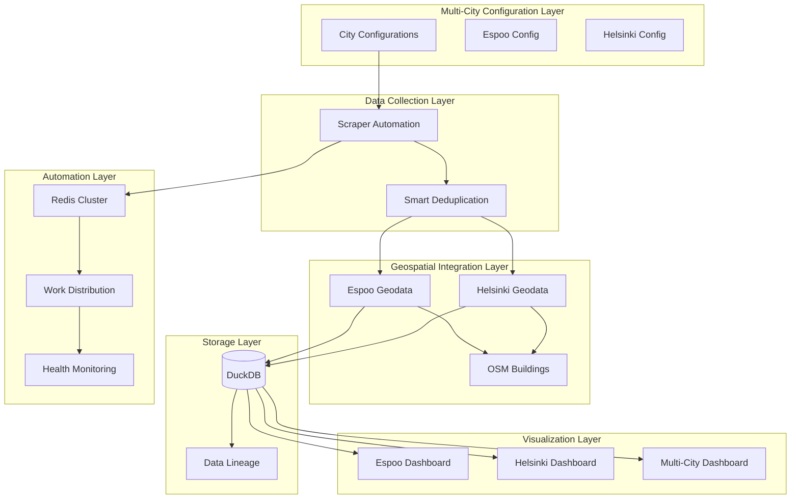

# Design Document

## Overview

This design document outlines the comprehensive expansion of the Oikotie Real Estate Analytics Platform to fully support Espoo city alongside Helsinki. The expansion leverages the existing robust architecture while adding Espoo-specific configurations, geospatial data integration, and ensuring seamless operation across both cities in all deployment scenarios.

The design follows the established system patterns and maintains compatibility with the existing daily automation system, cluster coordination, and visualization components while extending functionality to support multi-city operations.

## Architecture

### High-Level Architecture Enhancement



### Core Components Enhancement

#### 1. Configuration Management System
- **Multi-City Configuration**: Extend existing config.json to support both cities
- **City-Specific Parameters**: URL patterns, rate limits, worker configurations
- **Environment Detection**: Automatic city detection from deployment context
- **Configuration Validation**: Schema validation for multi-city setups

#### 2. Data Collection Enhancement
- **Unified Scraper Orchestrator**: Handle both Helsinki and Espoo with same reliability
- **City-Aware Work Distribution**: Intelligent work assignment across cities
- **Smart Deduplication**: Prevent duplicate work across city boundaries
- **Error Handling**: City-specific error patterns and recovery strategies

#### 3. Geospatial Data Integration
- **Espoo Municipal Data**: Integration with Espoo open data portals
- **OSM Building Footprints**: Extend building polygon matching to Espoo
- **Coordinate System Handling**: Ensure proper EPSG:4326 handling for both cities
- **Spatial Index Optimization**: City-specific spatial indexing strategies

#### 4. Database Schema Enhancement
- **City Column Enhancement**: Ensure proper city identification in all tables
- **Spatial Constraints**: City-specific coordinate bounds validation
- **Data Lineage**: Track data sources per city
- **Migration Scripts**: Versioned schema updates for Espoo support

## Components and Interfaces

### 1. Enhanced Configuration System

```python
class MultiCityConfig:
    """Enhanced configuration system for multi-city support"""
    
    def __init__(self, config_path: str = "config/config.json"):
        self.config_path = config_path
        self.cities = self._load_city_configs()
        self.validate_configurations()
    
    def get_city_config(self, city: str) -> CityConfiguration:
        """Get configuration for specific city"""
        pass
    
    def get_enabled_cities(self) -> List[str]:
        """Get list of enabled cities for processing"""
        pass
    
    def validate_configurations(self) -> bool:
        """Validate all city configurations"""
        pass

class CityConfiguration:
    """City-specific configuration container"""
    
    city: str
    enabled: bool
    url: str
    max_detail_workers: int
    rate_limit_seconds: float
    coordinate_bounds: Tuple[float, float, float, float]
    geospatial_sources: List[str]
```

### 2. Enhanced Scraper Orchestrator

```python
class MultiCityScraperOrchestrator:
    """Enhanced orchestrator for multi-city scraping operations"""
    
    def __init__(self, config: MultiCityConfig, cluster_coordinator: Optional[ClusterCoordinator] = None):
        self.config = config
        self.cluster_coordinator = cluster_coordinator
        self.city_scrapers = self._initialize_city_scrapers()
    
    def execute_daily_automation(self) -> Dict[str, ExecutionResult]:
        """Execute daily automation for all enabled cities"""
        pass
    
    def distribute_work_across_cities(self, work_items: List[WorkItem]) -> WorkDistribution:
        """Distribute work items across cities and nodes"""
        pass
    
    def handle_city_specific_errors(self, city: str, error: Exception) -> bool:
        """Handle city-specific error patterns"""
        pass
```

### 3. Enhanced Geospatial Integration

```python
class EspooGeospatialIntegrator:
    """Espoo-specific geospatial data integration"""
    
    def __init__(self, data_governance: DataGovernanceManager):
        self.data_governance = data_governance
        self.api_endpoints = self._configure_espoo_endpoints()
    
    def fetch_espoo_building_data(self, bbox: Tuple[float, float, float, float]) -> gpd.GeoDataFrame:
        """Fetch building footprint data for Espoo"""
        pass
    
    def geocode_espoo_addresses(self, addresses: List[str]) -> List[GeocodeResult]:
        """Geocode Espoo addresses with high accuracy"""
        pass
    
    def integrate_municipal_data(self) -> bool:
        """Integrate Espoo municipal geospatial data"""
        pass

class MultiCityGeospatialManager:
    """Unified geospatial data management for all cities"""
    
    def __init__(self):
        self.helsinki_integrator = HelsinkiGeospatialIntegrator()
        self.espoo_integrator = EspooGeospatialIntegrator()
    
    def process_city_listings(self, city: str, listings: List[Listing]) -> List[EnrichedListing]:
        """Process listings with city-appropriate geospatial enrichment"""
        pass
```

### 4. Enhanced Database Schema

```sql
-- Enhanced listings table with improved city support
ALTER TABLE listings ADD COLUMN IF NOT EXISTS city_validated BOOLEAN DEFAULT FALSE;
ALTER TABLE listings ADD COLUMN IF NOT EXISTS coordinate_source VARCHAR(50);
ALTER TABLE listings ADD COLUMN IF NOT EXISTS geospatial_quality_score REAL;

-- City-specific spatial constraints
CREATE OR REPLACE FUNCTION validate_city_coordinates(city VARCHAR, lat REAL, lon REAL) 
RETURNS BOOLEAN AS $$
BEGIN
    CASE city
        WHEN 'Helsinki' THEN
            RETURN lat BETWEEN 60.0 AND 60.5 AND lon BETWEEN 24.5 AND 25.5;
        WHEN 'Espoo' THEN
            RETURN lat BETWEEN 60.1 AND 60.4 AND lon BETWEEN 24.4 AND 24.9;
        ELSE
            RETURN FALSE;
    END CASE;
END;
$$ LANGUAGE plpgsql;

-- Enhanced data lineage for multi-city tracking
CREATE TABLE IF NOT EXISTS city_data_sources (
    id SERIAL PRIMARY KEY,
    city VARCHAR(50) NOT NULL,
    data_source_type VARCHAR(50) NOT NULL,
    api_endpoint TEXT,
    last_updated TIMESTAMP,
    data_quality_score REAL,
    records_count INTEGER,
    created_at TIMESTAMP DEFAULT CURRENT_TIMESTAMP
);
```

### 5. Enhanced Visualization System

```python
class MultiCityDashboardGenerator:
    """Enhanced dashboard generator with multi-city support"""
    
    def __init__(self, data_loader: DataLoader):
        self.data_loader = data_loader
        self.city_configs = self._load_city_configs()
    
    def generate_city_dashboard(self, city: str, enhanced_mode: bool = True) -> str:
        """Generate city-specific interactive dashboard"""
        pass
    
    def generate_comparative_dashboard(self, cities: List[str]) -> str:
        """Generate multi-city comparative dashboard"""
        pass
    
    def create_city_specific_maps(self, city: str) -> Dict[str, str]:
        """Create city-specific map visualizations"""
        pass
```

## Data Models

### Enhanced City Configuration Model

```json
{
  "tasks": [
    {
      "city": "Helsinki",
      "enabled": true,
      "url": "https://asunnot.oikotie.fi/myytavat-asunnot?locations=%5B%5B64,6,%22Helsinki%22%5D%5D&cardType=100",
      "max_detail_workers": 5,
      "rate_limit_seconds": 1.0,
      "coordinate_bounds": [24.5, 60.0, 25.5, 60.5],
      "geospatial_sources": [
        "helsinki_open_data",
        "osm_buildings",
        "national_geodata"
      ],
      "data_governance": {
        "max_requests_per_second": 1,
        "bulk_download_preference": true,
        "cache_duration_hours": 24
      }
    },
    {
      "city": "Espoo",
      "enabled": true,
      "url": "https://asunnot.oikotie.fi/myytavat-asunnot?locations=%5B%5B49,6,%22Espoo%22%5D%5D&cardType=100",
      "max_detail_workers": 5,
      "rate_limit_seconds": 1.0,
      "coordinate_bounds": [24.4, 60.1, 24.9, 60.4],
      "geospatial_sources": [
        "espoo_open_data",
        "osm_buildings",
        "national_geodata"
      ],
      "data_governance": {
        "max_requests_per_second": 1,
        "bulk_download_preference": true,
        "cache_duration_hours": 24
      }
    }
  ],
  "global_settings": {
    "database_path": "data/real_estate.duckdb",
    "output_directory": "output",
    "log_level": "INFO",
    "cluster_coordination": {
      "redis_url": "redis://localhost:6379",
      "heartbeat_interval": 30,
      "work_distribution_strategy": "round_robin"
    }
  }
}
```

### Enhanced Database Schema

```sql
-- Enhanced listings table
CREATE TABLE IF NOT EXISTS listings (
    url VARCHAR PRIMARY KEY,
    source VARCHAR,
    city VARCHAR NOT NULL,
    title VARCHAR,
    address VARCHAR,
    postal_code VARCHAR,
    listing_type VARCHAR,
    price_eur FLOAT,
    size_m2 FLOAT,
    rooms INTEGER,
    year_built INTEGER,
    overview VARCHAR,
    full_description VARCHAR,
    other_details_json VARCHAR,
    scraped_at TIMESTAMP,
    insert_ts TIMESTAMP DEFAULT CURRENT_TIMESTAMP,
    updated_ts TIMESTAMP,
    deleted_ts TIMESTAMP,
    
    -- Enhanced automation columns
    execution_id VARCHAR(50),
    last_check_ts TIMESTAMP,
    check_count INTEGER DEFAULT 0,
    last_error TEXT,
    retry_count INTEGER DEFAULT 0,
    data_quality_score REAL,
    data_source VARCHAR(50),
    fetch_timestamp TIMESTAMP,
    last_verified TIMESTAMP,
    source_url TEXT,
    
    -- Enhanced city-specific columns
    city_validated BOOLEAN DEFAULT FALSE,
    coordinate_source VARCHAR(50),
    geospatial_quality_score REAL,
    
    -- Spatial constraints
    CONSTRAINT valid_city_coordinates CHECK (
        validate_city_coordinates(city, latitude, longitude)
    )
);

-- Enhanced city-specific indexes
CREATE INDEX IF NOT EXISTS idx_listings_city_scraped ON listings(city, scraped_at);
CREATE INDEX IF NOT EXISTS idx_listings_city_quality ON listings(city, data_quality_score);
CREATE INDEX IF NOT EXISTS idx_listings_geospatial_quality ON listings(geospatial_quality_score);
```

## Error Handling

### Multi-City Error Handling Strategy

#### 1. City-Specific Error Patterns
```python
class CityErrorHandler:
    """Handle city-specific error patterns and recovery strategies"""
    
    ERROR_PATTERNS = {
        'Helsinki': {
            'rate_limit_indicators': ['429', 'too many requests'],
            'data_source_failures': ['hri.fi unavailable'],
            'recovery_strategies': ['exponential_backoff', 'alternative_source']
        },
        'Espoo': {
            'rate_limit_indicators': ['429', 'blocked'],
            'data_source_failures': ['espoo.fi timeout'],
            'recovery_strategies': ['circuit_breaker', 'cached_fallback']
        }
    }
    
    def handle_city_error(self, city: str, error: Exception) -> ErrorHandlingResult:
        """Handle error with city-specific strategies"""
        pass
```

#### 2. Graceful Degradation
- **Partial City Failure**: Continue processing other cities if one fails
- **Data Source Fallback**: Use cached data when APIs are unavailable
- **Quality Score Adjustment**: Lower quality scores for degraded data sources
- **User Notification**: Clear communication about data availability issues

#### 3. Error Recovery Mechanisms
- **Exponential Backoff**: City-specific backoff strategies
- **Circuit Breaker**: Prevent cascading failures across cities
- **Health Check Integration**: Monitor city-specific service health
- **Automatic Retry**: Intelligent retry with city-aware logic

## Testing Strategy

### Progressive Validation Implementation

#### 1. Step 1: Small Sample Validation (10-20 listings per city)
```python
class MultiCitySmallSampleValidator:
    """Validate basic functionality with small samples from both cities"""
    
    def validate_espoo_scraping(self) -> ValidationResult:
        """Test Espoo scraping with 10 sample listings"""
        pass
    
    def validate_helsinki_compatibility(self) -> ValidationResult:
        """Ensure Helsinki functionality remains intact"""
        pass
    
    def validate_geospatial_integration(self) -> ValidationResult:
        """Test geospatial data integration for both cities"""
        pass
```

#### 2. Step 2: Medium Scale Validation (100-500 listings per city)
```python
class MultiCityMediumScaleValidator:
    """Validate scalability and performance with medium datasets"""
    
    def validate_cluster_coordination(self) -> ValidationResult:
        """Test work distribution across cities in cluster mode"""
        pass
    
    def validate_database_performance(self) -> ValidationResult:
        """Test database performance with multi-city data"""
        pass
    
    def validate_visualization_generation(self) -> ValidationResult:
        """Test dashboard generation for both cities"""
        pass
```

#### 3. Step 3: Full Scale Production Validation
```python
class MultiCityProductionValidator:
    """Validate production readiness with full datasets"""
    
    def validate_daily_automation(self) -> ValidationResult:
        """Test complete daily automation workflow"""
        pass
    
    def validate_monitoring_systems(self) -> ValidationResult:
        """Test monitoring and alerting for multi-city operations"""
        pass
    
    def validate_deployment_scenarios(self) -> ValidationResult:
        """Test all deployment modes with multi-city support"""
        pass
```

### Quality Gates and Success Criteria

#### Technical Correctness
- **Scraping Success Rate**: ≥95% for both cities
- **Geocoding Accuracy**: ≥95% for both cities
- **Database Integrity**: 100% constraint compliance
- **API Rate Limit Compliance**: 100% adherence to governance rules

#### Logical Correctness
- **Address Validation**: Manual verification of address geocoding
- **Building Footprint Matching**: Visual verification of spatial relationships
- **Data Quality Consistency**: Comparable quality scores across cities
- **User Experience**: Intuitive multi-city dashboard navigation

#### Performance Acceptability
- **Processing Speed**: Comparable performance to single-city operations
- **Memory Usage**: Efficient resource utilization for multi-city data
- **Database Query Performance**: Optimized multi-city queries
- **Visualization Rendering**: Acceptable load times for dashboards

This comprehensive design ensures robust, scalable, and maintainable expansion of the Oikotie platform to support Espoo while maintaining all existing functionality and quality standards.