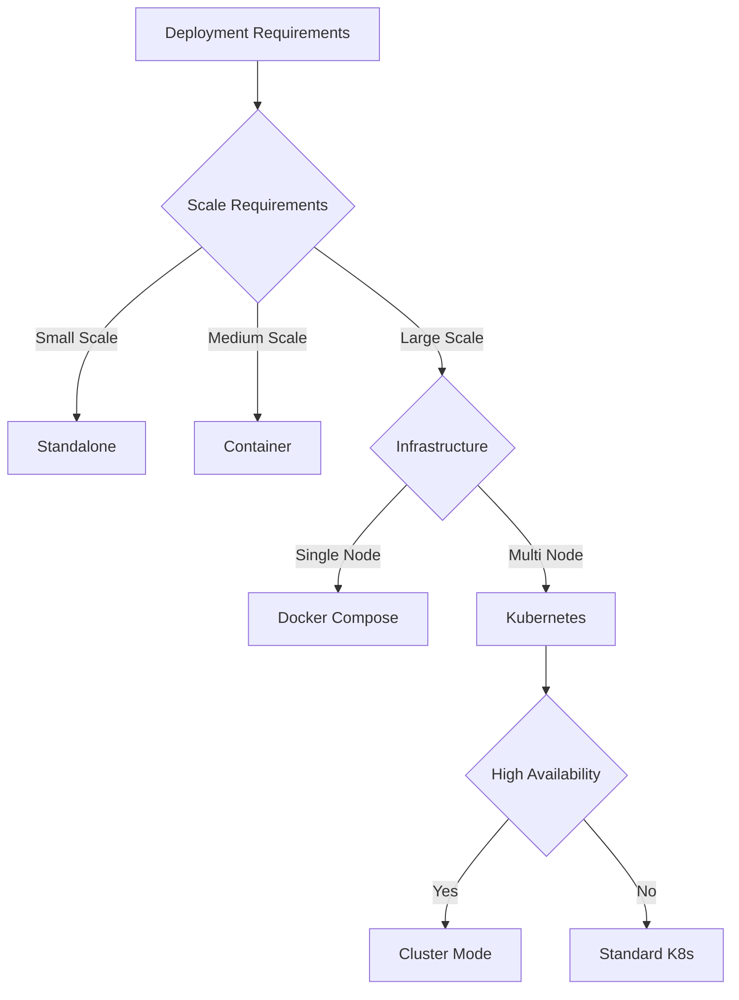

# Oikotie Daily Scraper Automation - Deployment Guide

This comprehensive guide covers all deployment scenarios for the Oikotie Daily Scraper Automation system, from standalone applications to distributed Kubernetes clusters.

## Table of Contents

1. [Quick Start](#quick-start)
2. [Deployment Options](#deployment-options)
3. [Standalone Deployment](#standalone-deployment)
4. [Container Deployment](#container-deployment)
5. [Kubernetes Deployment](#kubernetes-deployment)
6. [Cluster Deployment](#cluster-deployment)
7. [Configuration Management](#configuration-management)
8. [Monitoring and Observability](#monitoring-and-observability)
9. [Security Considerations](#security-considerations)
10. [Troubleshooting](#troubleshooting)

## Quick Start

### Prerequisites

- Python 3.9+ (for standalone deployment)
- Docker (for container deployment)
- Kubernetes cluster (for K8s deployment)
- Helm 3.x (for Helm deployment)

### Minimal Setup

```bash
# Clone the repository
git clone <repository-url>
cd oikotie-scraper

# Standalone deployment
uv sync --all-extras
uv run python -m oikotie.automation.cli run --daily

# Container deployment
docker-compose up -d

# Kubernetes deployment
helm install oikotie-scraper k8s/helm/oikotie-scraper/
```

## Deployment Options

The Oikotie Daily Scraper Automation system supports multiple deployment architectures:

| Deployment Type | Use Case | Complexity | Scalability | Monitoring |
|----------------|----------|------------|-------------|------------|
| **Standalone** | Development, small-scale | Low | Limited | Basic |
| **Container** | Single-node production | Medium | Moderate | Good |
| **Kubernetes** | Cloud-native, enterprise | High | Excellent | Advanced |
| **Cluster** | High-availability, distributed | High | Excellent | Advanced |

### Architecture Decision Matrix



## Standalone Deployment

### System Requirements

- **OS**: Windows 10+, macOS 10.15+, Ubuntu 18.04+
- **Python**: 3.9 or higher
- **Memory**: 2GB RAM minimum, 4GB recommended
- **Storage**: 10GB free space for data and logs
- **Network**: Internet access for scraping

### Installation Steps

1. **Environment Setup**
   ```bash
   # Install uv (Python package manager)
   pip install uv
   
   # Clone and setup project
   git clone <repository-url>
   cd oikotie-scraper
   uv sync --all-extras
   ```

2. **Configuration**
   ```bash
   # Copy configuration template
   cp config/config.json.template config/config.json
   
   # Edit configuration
   # Set cities, database path, and scraping parameters
   ```

3. **Database Initialization**
   ```bash
   # Initialize database schema
   uv run python -m oikotie.database.migration init
   ```

4. **Run Scraper**
   ```bash
   # One-time execution
   uv run python -m oikotie.automation.cli run --daily
   
   # Scheduled execution (cron)
   # Add to crontab: 0 2 * * * /path/to/uv run python -m oikotie.automation.cli run --daily
   ```

### Standalone Configuration

```json
{
  "deployment": {
    "type": "standalone",
    "database_path": "./data/real_estate.duckdb",
    "log_level": "INFO",
    "max_workers": 3,
    "headless_browser": false
  },
  "tasks": [
    {
      "city": "Helsinki",
      "enabled": true,
      "url": "https://asunnot.oikotie.fi/myytavat-asunnot?locations=%5B%5B64,6,%22Helsinki%22%5D%5D&cardType=100",
      "max_detail_workers": 2
    }
  ]
}
```

## Container Deployment

### Docker Deployment

#### Single Container

```bash
# Build image
docker build -t oikotie-scraper:latest .

# Run container
docker run -d \
  --name oikotie-scraper \
  -v $(pwd)/data:/data \
  -v $(pwd)/logs:/logs \
  -v $(pwd)/config:/app/config:ro \
  -p 8080:8080 \
  oikotie-scraper:latest
```

#### Docker Compose

```bash
# Start services
docker-compose up -d

# View logs
docker-compose logs -f scraper

# Stop services
docker-compose down
```

### Container Configuration

The container deployment uses environment variables for configuration:

```yaml
# docker-compose.yml
services:
  scraper:
    environment:
      - ENVIRONMENT=production
      - DEPLOYMENT_TYPE=container
      - DATABASE_PATH=/data/real_estate.duckdb
      - LOG_LEVEL=INFO
      - MAX_WORKERS=5
      - HEADLESS_BROWSER=true
```

### Volume Management

```yaml
volumes:
  # Data persistence
  - scraper_data:/data          # Database and processed data
  - scraper_logs:/logs          # Application logs
  - scraper_output:/output      # Generated reports
  
  # Configuration (read-only)
  - ./config:/app/config:ro     # Configuration files
```

## Kubernetes Deployment

### Prerequisites

- Kubernetes cluster (1.19+)
- Helm 3.x
- kubectl configured
- Persistent storage provider

### Helm Deployment

1. **Add Helm Repository** (if using external chart)
   ```bash
   helm repo add oikotie-scraper https://charts.example.com/oikotie-scraper
   helm repo update
   ```

2. **Install with Default Values**
   ```bash
   helm install oikotie-scraper k8s/helm/oikotie-scraper/ \
     --namespace oikotie-scraper \
     --create-namespace
   ```

3. **Install with Custom Values**
   ```bash
   # Create custom values file
   cat > values-production.yaml << EOF
   deployment:
     replicaCount: 5
   
   resources:
     requests:
       memory: "1Gi"
       cpu: "500m"
     limits:
       memory: "2Gi"
       cpu: "1000m"
   
   persistence:
     size: 50Gi
     storageClass: "fast-ssd"
   
   monitoring:
     enabled: true
   EOF
   
   # Install with custom values
   helm install oikotie-scraper k8s/helm/oikotie-scraper/ \
     --namespace oikotie-scraper \
     --create-namespace \
     -f values-production.yaml
   ```

### Manual Kubernetes Deployment

```bash
# Apply manifests
kubectl apply -f k8s/namespace.yaml
kubectl apply -f k8s/redis.yaml
kubectl apply -f k8s/scraper-cluster.yaml

# Check deployment status
kubectl get pods -n oikotie-scraper
kubectl get services -n oikotie-scraper
```

### Kubernetes Configuration

Key configuration options for Kubernetes deployment:

```yaml
# values.yaml
deployment:
  replicaCount: 3
  strategy:
    type: RollingUpdate
    rollingUpdate:
      maxSurge: 1
      maxUnavailable: 0

autoscaling:
  enabled: true
  minReplicas: 2
  maxReplicas: 10
  targetCPUUtilizationPercentage: 70

persistence:
  enabled: true
  accessMode: ReadWriteMany
  size: 20Gi

monitoring:
  enabled: true
  serviceMonitor:
    enabled: true
```

## Cluster Deployment

### High-Availability Setup

For production environments requiring high availability:

```bash
# Deploy with cluster configuration
helm install oikotie-scraper k8s/helm/oikotie-scraper/ \
  --namespace oikotie-scraper \
  --create-namespace \
  --set deployment.replicaCount=5 \
  --set redis.replica.replicaCount=2 \
  --set autoscaling.enabled=true \
  --set podDisruptionBudget.enabled=true
```

### Multi-Region Deployment

For multi-region deployments:

```yaml
# values-multi-region.yaml
affinity:
  podAntiAffinity:
    preferredDuringSchedulingIgnoredDuringExecution:
    - weight: 100
      podAffinityTerm:
        labelSelector:
          matchExpressions:
          - key: app.kubernetes.io/name
            operator: In
            values:
            - oikotie-scraper
        topologyKey: topology.kubernetes.io/zone

nodeSelector:
  node-type: scraper-optimized

tolerations:
- key: "scraper-workload"
  operator: "Equal"
  value: "true"
  effect: "NoSchedule"
```

## Configuration Management

### Configuration Hierarchy

The system loads configuration from multiple sources in order of precedence:

1. **Command-line arguments** (highest priority)
2. **Environment variables**
3. **Configuration files**
4. **Default values** (lowest priority)

### Environment Variables

| Variable | Description | Default |
|----------|-------------|---------|
| `ENVIRONMENT` | Deployment environment | `development` |
| `DEPLOYMENT_TYPE` | Deployment type | `standalone` |
| `DATABASE_PATH` | Database file path | `./data/real_estate.duckdb` |
| `LOG_LEVEL` | Logging level | `INFO` |
| `MAX_WORKERS` | Maximum worker threads | `3` |
| `HEADLESS_BROWSER` | Run browser in headless mode | `false` |
| `REDIS_URL` | Redis connection URL | `redis://localhost:6379` |

### Configuration Files

#### Main Configuration (`config/config.json`)

```json
{
  "deployment": {
    "health_check_port": 8080,
    "database_path": "/data/real_estate.duckdb",
    "log_level": "INFO",
    "max_workers": 3,
    "headless_browser": true,
    "enable_metrics": true,
    "graceful_shutdown_timeout": 30
  },
  "scraping": {
    "staleness_threshold_hours": 24,
    "retry_limit": 3,
    "batch_size": 50,
    "rate_limit_delay": 1.0
  },
  "tasks": [
    {
      "city": "Helsinki",
      "enabled": true,
      "url": "https://asunnot.oikotie.fi/myytavat-asunnot?locations=%5B%5B64,6,%22Helsinki%22%5D%5D&cardType=100",
      "max_detail_workers": 3
    }
  ],
  "monitoring": {
    "metrics_enabled": true,
    "health_check_enabled": true,
    "prometheus_port": 9090
  },
  "alerting": {
    "email": {
      "enabled": false,
      "smtp_server": "smtp.example.com",
      "smtp_port": 587,
      "username": "",
      "password": "",
      "recipients": []
    },
    "slack": {
      "enabled": false,
      "webhook_url": ""
    }
  }
}
```

## Monitoring and Observability

### Health Checks

The system provides comprehensive health check endpoints:

- **Liveness**: `/health/live` - Basic application health
- **Readiness**: `/health/ready` - Ready to accept traffic
- **Metrics**: `/metrics` - Prometheus-compatible metrics

### Metrics Collection

Key metrics exposed:

```
# Scraping metrics
scraper_listings_processed_total
scraper_listings_new_total
scraper_listings_updated_total
scraper_listings_failed_total
scraper_execution_duration_seconds

# System metrics
scraper_memory_usage_bytes
scraper_cpu_usage_percent
scraper_database_size_bytes

# Quality metrics
scraper_geocoding_success_rate
scraper_data_quality_score
```

### Prometheus Configuration

```yaml
# prometheus.yml
scrape_configs:
  - job_name: 'oikotie-scraper'
    static_configs:
      - targets: ['oikotie-scraper:8080']
    metrics_path: '/metrics'
    scrape_interval: 30s
```

### Grafana Dashboard

Import the provided Grafana dashboard (`monitoring/grafana-dashboard.json`) for comprehensive monitoring visualization.

## Security Considerations

### Container Security

1. **Non-root User**: Containers run as non-root user (UID 1000)
2. **Read-only Root Filesystem**: Where possible
3. **Security Scanning**: Automated vulnerability scanning
4. **Minimal Base Image**: Using slim Python images

### Network Security

1. **Network Policies**: Restrict pod-to-pod communication
2. **TLS Encryption**: All external communications use TLS
3. **Secret Management**: Use Kubernetes secrets for sensitive data

### Access Control

1. **RBAC**: Role-based access control for Kubernetes
2. **Service Accounts**: Dedicated service accounts with minimal permissions
3. **Pod Security Standards**: Enforce security policies

## Troubleshooting

### Common Issues

#### 1. Database Connection Issues

**Symptoms**: Application fails to start, database errors in logs

**Solutions**:
```bash
# Check database file permissions
ls -la data/real_estate.duckdb

# Verify database path in configuration
grep database_path config/config.json

# Test database connection
uv run python -c "import duckdb; conn = duckdb.connect('data/real_estate.duckdb'); print('OK')"
```

#### 2. Browser Automation Issues

**Symptoms**: Selenium errors, browser crashes

**Solutions**:
```bash
# Check Chrome installation
google-chrome --version

# Verify ChromeDriver
chromedriver --version

# Test headless mode
export HEADLESS_BROWSER=true
```

#### 3. Memory Issues

**Symptoms**: Out of memory errors, pod restarts

**Solutions**:
```yaml
# Increase memory limits
resources:
  limits:
    memory: "2Gi"
  requests:
    memory: "1Gi"

# Reduce worker count
env:
  - name: MAX_WORKERS
    value: "2"
```

#### 4. Network Connectivity

**Symptoms**: Scraping failures, timeout errors

**Solutions**:
```bash
# Test network connectivity
curl -I https://asunnot.oikotie.fi

# Check DNS resolution
nslookup asunnot.oikotie.fi

# Verify proxy settings (if applicable)
echo $HTTP_PROXY
```

### Debugging Commands

```bash
# Check pod status
kubectl get pods -n oikotie-scraper

# View pod logs
kubectl logs -f deployment/oikotie-scraper -n oikotie-scraper

# Execute into pod
kubectl exec -it deployment/oikotie-scraper -n oikotie-scraper -- /bin/bash

# Check resource usage
kubectl top pods -n oikotie-scraper

# Describe pod for events
kubectl describe pod <pod-name> -n oikotie-scraper
```

### Log Analysis

```bash
# Filter error logs
kubectl logs deployment/oikotie-scraper -n oikotie-scraper | grep ERROR

# Monitor real-time logs
kubectl logs -f deployment/oikotie-scraper -n oikotie-scraper --tail=100

# Export logs for analysis
kubectl logs deployment/oikotie-scraper -n oikotie-scraper > scraper-logs.txt
```

## Performance Tuning

### Resource Optimization

```yaml
# Optimized resource configuration
resources:
  requests:
    memory: "512Mi"
    cpu: "200m"
  limits:
    memory: "1Gi"
    cpu: "500m"

# JVM tuning for DuckDB (if applicable)
env:
  - name: JAVA_OPTS
    value: "-Xmx512m -XX:+UseG1GC"
```

### Scaling Configuration

```yaml
# Horizontal Pod Autoscaler
autoscaling:
  enabled: true
  minReplicas: 2
  maxReplicas: 10
  targetCPUUtilizationPercentage: 70
  targetMemoryUtilizationPercentage: 80

# Vertical Pod Autoscaler (if available)
vpa:
  enabled: true
  updateMode: "Auto"
```

## Backup and Recovery

### Database Backup

```bash
# Manual backup
cp data/real_estate.duckdb data/backup/real_estate_$(date +%Y%m%d).duckdb

# Automated backup (Kubernetes CronJob)
kubectl apply -f k8s/backup-cronjob.yaml
```

### Disaster Recovery

1. **Data Recovery**: Restore from persistent volume snapshots
2. **Configuration Recovery**: Restore from Git repository
3. **Application Recovery**: Redeploy using Helm charts

## Maintenance

### Regular Maintenance Tasks

1. **Update Dependencies**: Monthly security updates
2. **Database Maintenance**: Weekly optimization
3. **Log Rotation**: Daily log cleanup
4. **Monitoring Review**: Weekly performance analysis

### Upgrade Procedures

```bash
# Helm upgrade
helm upgrade oikotie-scraper k8s/helm/oikotie-scraper/ \
  --namespace oikotie-scraper \
  -f values-production.yaml

# Rollback if needed
helm rollback oikotie-scraper 1 --namespace oikotie-scraper
```

## Support and Documentation

- **Technical Documentation**: `/docs/`
- **API Documentation**: `/docs/api/`
- **Troubleshooting Guide**: `/docs/troubleshooting/`
- **Best Practices**: `/docs/best-practices/`

For additional support, please refer to the project repository or contact the development team.