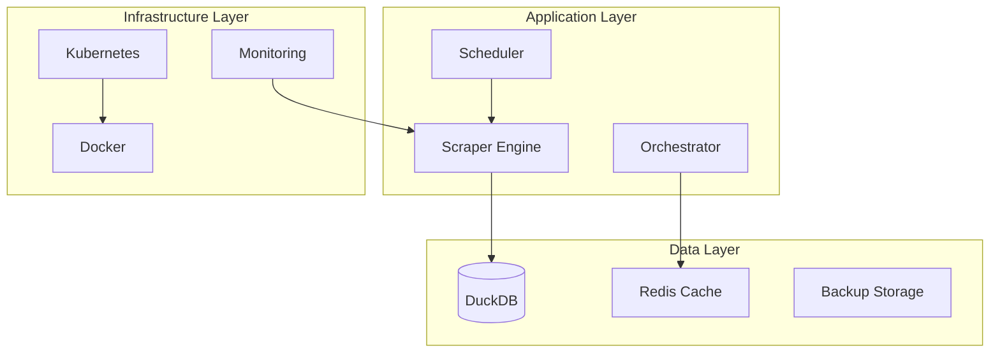

# Oikotie Daily Scraper Automation - Deployment Documentation

Welcome to the comprehensive deployment documentation for the Oikotie Daily Scraper Automation system. This documentation provides everything you need to deploy, configure, and operate the system across different environments.

## 📚 Documentation Overview

### Quick Start Guides
- **[Deployment Guide](README.md)** - Complete deployment guide for all scenarios
- **[Configuration Examples](configuration-examples.md)** - Ready-to-use configuration templates
- **[Multi-City Best Practices](multi-city-best-practices.md)** - Best practices for multi-city deployments
- **[CLI Commands](cli-commands.md)** - Comprehensive CLI command documentation
- **[Multi-City Troubleshooting](multi-city-troubleshooting.md)** - Troubleshooting multi-city issues
- **[Troubleshooting Guide](troubleshooting-guide.md)** - Common issues and solutions
- **[Operational Runbooks](operational-runbooks.md)** - Step-by-step operational procedures

### Deployment Artifacts
- **Docker Images** - Multi-stage builds with security scanning
- **Kubernetes Manifests** - Production-ready K8s deployments
- **Helm Charts** - Flexible, configurable deployments
- **Docker Compose** - Single-node container deployments

## 🚀 Quick Deployment

### Choose Your Deployment Method

| Method | Complexity | Use Case | Time to Deploy |
|--------|------------|----------|----------------|
| **Standalone** | Low | Development, testing | 5 minutes |
| **Docker Compose** | Medium | Single-node production | 10 minutes |
| **Kubernetes** | High | Cloud-native, scalable | 20 minutes |
| **Helm Chart** | Medium | Kubernetes with flexibility | 15 minutes |

### 30-Second Start

```bash
# Standalone (Development)
git clone <repository>
cd oikotie-scraper
uv sync --all-extras
uv run python -m oikotie.automation.cli run --daily

# Docker Compose (Production)
docker-compose up -d

# Kubernetes (Enterprise)
helm install oikotie-scraper k8s/helm/oikotie-scraper/
```

## 📋 Deployment Checklist

### Pre-Deployment
- [ ] Review [system requirements](README.md#system-requirements)
- [ ] Choose [deployment architecture](README.md#deployment-options)
- [ ] Prepare [configuration files](configuration-examples.md)
- [ ] Set up [monitoring infrastructure](README.md#monitoring-and-observability)
- [ ] Configure [security settings](README.md#security-considerations)

### Deployment
- [ ] Follow [deployment guide](README.md) for your chosen method
- [ ] Verify [health checks](troubleshooting-guide.md#quick-diagnostic-commands)
- [ ] Test [functionality](operational-runbooks.md#post-deployment-verification)
- [ ] Configure [monitoring](operational-runbooks.md#monitoring-setup-runbook)
- [ ] Set up [backup procedures](operational-runbooks.md#backup-creation-runbook)

### Post-Deployment
- [ ] Run [daily maintenance](operational-runbooks.md#daily-maintenance-runbook)
- [ ] Schedule [weekly maintenance](operational-runbooks.md#weekly-maintenance-runbook)
- [ ] Configure [alerting](troubleshooting-guide.md#monitoring-and-alerting)
- [ ] Document [custom configurations](configuration-examples.md)
- [ ] Train [operations team](operational-runbooks.md)

## 🏗️ Architecture Overview

### System Components



### Deployment Patterns

#### Pattern 1: Development Environment
```yaml
Environment: Development
Deployment: Standalone Python
Database: Local DuckDB
Monitoring: Basic logging
Security: Minimal
```

#### Pattern 2: Production Single-Node
```yaml
Environment: Production
Deployment: Docker Compose
Database: Persistent DuckDB
Monitoring: Prometheus + Grafana
Security: Container security
```

#### Pattern 3: Enterprise Kubernetes
```yaml
Environment: Production
Deployment: Kubernetes + Helm
Database: Shared persistent storage
Monitoring: Full observability stack
Security: Pod security policies
```

## 🔧 Configuration Management

### Configuration Hierarchy
1. **Default Values** - Built into application
2. **Configuration Files** - JSON/YAML files
3. **Environment Variables** - Runtime overrides
4. **Command Line Arguments** - Execution-time overrides

### Environment Templates

#### Development
```json
{
  "deployment": {
    "type": "standalone",
    "log_level": "DEBUG",
    "max_workers": 2,
    "headless_browser": false
  },
  "scraping": {
    "staleness_threshold_hours": 1,
    "batch_size": 10
  }
}
```

#### Production
```json
{
  "deployment": {
    "type": "cluster",
    "log_level": "INFO",
    "max_workers": 5,
    "headless_browser": true
  },
  "scraping": {
    "staleness_threshold_hours": 24,
    "batch_size": 50
  }
}
```

## 📊 Monitoring and Observability

### Key Metrics
- **Scraping Performance**: Listings processed, success rate, duration
- **System Health**: CPU, memory, disk usage
- **Data Quality**: Geocoding success, validation errors
- **Business Metrics**: New listings, market coverage

### Alert Conditions
- **Critical**: Service down, database corruption
- **Warning**: High error rate, performance degradation
- **Info**: Successful deployments, maintenance completion

### Dashboards
- **Operational Dashboard**: System health and performance
- **Business Dashboard**: Scraping metrics and data quality
- **Infrastructure Dashboard**: Resource utilization

## 🔒 Security Considerations

### Security Layers
1. **Container Security**: Non-root users, minimal images
2. **Network Security**: Network policies, TLS encryption
3. **Data Security**: Encryption at rest, secure secrets
4. **Access Control**: RBAC, service accounts

### Security Checklist
- [ ] Container images scanned for vulnerabilities
- [ ] Secrets managed externally (not in code)
- [ ] Network policies restrict pod communication
- [ ] RBAC configured with minimal permissions
- [ ] Audit logging enabled
- [ ] Regular security updates applied

## 🚨 Incident Response

### Response Times
- **Critical (P0)**: 1 minute response, 15 minutes resolution
- **High (P1)**: 15 minutes response, 1 hour resolution
- **Medium (P2)**: 1 hour response, 4 hours resolution
- **Low (P3)**: 4 hours response, 24 hours resolution

### Escalation Path
1. **On-call Engineer** - First response
2. **DevOps Lead** - Technical escalation
3. **Engineering Manager** - Management escalation
4. **CTO** - Executive escalation

### Common Scenarios
- [Service Down](troubleshooting-guide.md#service-down-alert)
- [High Error Rate](troubleshooting-guide.md#high-error-rate-alert)
- [Database Issues](troubleshooting-guide.md#database-corruption-alert)
- [Security Incident](troubleshooting-guide.md#security-incident-response)

## 📈 Performance Optimization

### Performance Tuning
- **Resource Allocation**: CPU, memory, storage optimization
- **Concurrency**: Worker thread optimization
- **Database**: Query optimization, indexing
- **Network**: Connection pooling, timeout tuning

### Scaling Strategies
- **Vertical Scaling**: Increase pod resources
- **Horizontal Scaling**: Increase pod replicas
- **Auto-scaling**: HPA based on metrics
- **Load Balancing**: Distribute traffic evenly

## 🔄 Maintenance Procedures

### Regular Maintenance
- **Daily**: Health checks, log rotation
- **Weekly**: Database optimization, security scans
- **Monthly**: Full backups, performance analysis
- **Quarterly**: Dependency updates, capacity planning

### Update Procedures
1. **Rolling Updates**: Zero-downtime deployments
2. **Blue-Green**: Full environment switches
3. **Canary**: Gradual traffic shifting
4. **Rollback**: Quick reversion procedures

## 📚 Additional Resources

### Documentation
- **[API Documentation](../api/)** - REST API reference
- **[Database Schema](../database/)** - Data model documentation
- **[Error Codes](../errors/)** - Error reference guide
- **[Best Practices](../best-practices/)** - Development guidelines

### Tools and Scripts
- **[Build Scripts](../../docker/)** - Docker build automation
- **[Monitoring Configs](../../monitoring/)** - Prometheus/Grafana setup
- **[Backup Scripts](../../scripts/backup/)** - Automated backup tools
- **[Testing Scripts](../../scripts/testing/)** - Validation and testing

### Support Channels
- **Documentation**: This repository
- **Issues**: GitHub Issues
- **Discussions**: GitHub Discussions
- **Emergency**: On-call rotation

## 🎯 Success Criteria

### Deployment Success
- [ ] All pods running and healthy
- [ ] Health checks passing
- [ ] Database connectivity verified
- [ ] Monitoring active
- [ ] Alerts configured

### Operational Success
- [ ] Daily scraping completing successfully
- [ ] Error rates below 5%
- [ ] Response times under 30 seconds
- [ ] Data quality above 95%
- [ ] Uptime above 99.9%

### Business Success
- [ ] New listings captured daily
- [ ] Market coverage maintained
- [ ] Data freshness under 24 hours
- [ ] Analytics pipeline functioning
- [ ] Stakeholder requirements met

---

## Getting Started

1. **Choose your deployment method** from the options above
2. **Follow the appropriate guide** in the documentation
3. **Configure monitoring** and alerting
4. **Test the deployment** thoroughly
5. **Set up maintenance procedures**

For detailed instructions, start with the [Deployment Guide](README.md) and refer to other documents as needed.

**Need help?** Check the [Troubleshooting Guide](troubleshooting-guide.md) or review the [Operational Runbooks](operational-runbooks.md) for step-by-step procedures.