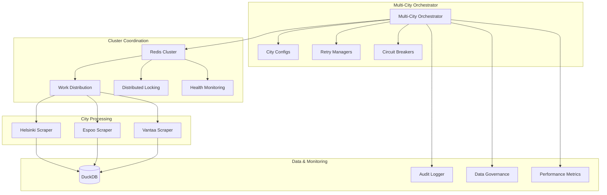

# Multi-City Automation System

## Overview

The Multi-City Automation System is an enhanced version of the Oikotie scraper that provides comprehensive support for automated data collection across multiple Finnish cities. The system includes Redis cluster coordination, smart work distribution, exponential backoff, circuit breaker patterns, and comprehensive audit logging.

## Key Features

### 🏙️ Multi-City Support
- **Simultaneous Processing**: Handle multiple cities (Helsinki, Espoo, etc.) in parallel or sequentially
- **City-Specific Configuration**: Individual settings for each city including rate limits, worker counts, and priorities
- **Priority-Based Execution**: Cities can be prioritized for execution order

### 🔄 Redis Cluster Coordination
- **Distributed Execution**: Multiple nodes can work together using Redis for coordination
- **Work Distribution**: Intelligent assignment of cities across cluster nodes
- **Distributed Locking**: Prevents duplicate work execution across nodes
- **Health Monitoring**: Continuous monitoring of node health and automatic failover

### 🛡️ Resilience Patterns
- **Circuit Breaker**: Prevents cascading failures by temporarily blocking requests to failing services
- **Exponential Backoff**: Intelligent retry logic with increasing delays
- **Rate Limiting**: Respects API rate limits and data governance rules
- **Graceful Degradation**: System continues operating even when some components fail

### 📊 Comprehensive Monitoring
- **Audit Logging**: Complete audit trail of all operations and decisions
- **Data Lineage Tracking**: Track the source and transformation of all data
- **Performance Metrics**: Detailed performance monitoring and reporting
- **Error Categorization**: Intelligent error classification and handling

## Architecture



## Configuration

### Basic Configuration

The system uses the existing `config/config.json` file with enhanced multi-city support:

```json
{
  "tasks": [
    {
      "city": "Helsinki",
      "enabled": true,
      "url": "https://asunnot.oikotie.fi/myytavat-asunnot?locations=%5B%5B64,6,%22Helsinki%22%5D%5D&cardType=100",
      "max_detail_workers": 5,
      "rate_limit_seconds": 1.0,
      "coordinate_bounds": [24.5, 60.0, 25.5, 60.5],
      "geospatial_sources": [
        "helsinki_open_data",
        "osm_buildings",
        "national_geodata"
      ],
      "priority": 2,
      "data_governance": {
        "max_requests_per_second": 1,
        "bulk_download_preference": true,
        "cache_duration_hours": 24
      }
    },
    {
      "city": "Espoo",
      "enabled": true,
      "url": "https://asunnot.oikotie.fi/myytavat-asunnot?locations=%5B%5B49,6,%22Espoo%22%5D%5D&cardType=100",
      "max_detail_workers": 5,
      "rate_limit_seconds": 1.0,
      "coordinate_bounds": [24.4, 60.1, 24.9, 60.4],
      "geospatial_sources": [
        "espoo_open_data",
        "osm_buildings",
        "national_geodata"
      ],
      "priority": 1,
      "data_governance": {
        "max_requests_per_second": 1,
        "bulk_download_preference": true,
        "cache_duration_hours": 24
      }
    }
  ],
  "global_settings": {
    "database_path": "data/real_estate.duckdb",
    "output_directory": "output",
    "log_level": "INFO",
    "cluster_coordination": {
      "redis_url": "redis://localhost:6379",
      "heartbeat_interval": 30,
      "work_distribution_strategy": "round_robin"
    }
  }
}
```

### City Configuration Options

| Parameter | Type | Description | Default |
|-----------|------|-------------|---------|
| `city` | string | City name | Required |
| `enabled` | boolean | Whether city is enabled for processing | Required |
| `url` | string | Oikotie URL for the city | Required |
| `max_detail_workers` | integer | Number of parallel workers for detail scraping | 5 |
| `rate_limit_seconds` | float | Delay between requests in seconds | 1.0 |
| `coordinate_bounds` | array | [min_lon, min_lat, max_lon, max_lat] | null |
| `geospatial_sources` | array | List of geospatial data sources | [] |
| `priority` | integer | Execution priority (higher = first) | 1 |
| `data_governance` | object | Data governance settings | {} |

### Cluster Coordination Settings

| Parameter | Type | Description | Default |
|-----------|------|-------------|---------|
| `redis_url` | string | Redis connection URL | null |
| `heartbeat_interval` | integer | Health check interval in seconds | 30 |
| `work_distribution_strategy` | string | Strategy for work distribution | "round_robin" |

## Usage

### Basic Usage

```python
from oikotie.automation.multi_city_orchestrator import create_multi_city_orchestrator

# Create orchestrator
orchestrator = create_multi_city_orchestrator(
    config_path='config/config.json',
    redis_url='redis://localhost:6379',
    enable_cluster_coordination=True
)

# Run daily automation
result = orchestrator.run_daily_automation()

print(f"Status: {result.status.value}")
print(f"Cities processed: {result.successful_cities}/{result.total_cities}")
print(f"New listings: {result.total_listings_new}")
print(f"Execution time: {result.execution_time_seconds:.1f}s")
```

### Standalone Mode (No Redis)

```python
# Run without cluster coordination
orchestrator = create_multi_city_orchestrator(
    config_path='config/config.json',
    enable_cluster_coordination=False
)

result = orchestrator.run_daily_automation()
```

### Using the Enhanced Daily Automation Script

```bash
# Run with cluster coordination setup
python scripts/automation/run_daily_automation.py --setup-cron

# Run standalone
python scripts/automation/run_daily_automation.py
```

## Execution Modes

### Sequential Execution
- Cities are processed one after another
- Used when cluster coordination is disabled
- Respects city priorities and rate limits
- Suitable for single-node deployments

### Cluster Coordination
- Cities are distributed across multiple nodes
- Uses Redis for work distribution and locking
- Automatic failover and work redistribution
- Suitable for high-availability deployments

## Resilience Features

### Circuit Breaker Pattern

The system implements circuit breakers for each city to prevent cascading failures:

```python
# Circuit breaker states
CLOSED    # Normal operation
OPEN      # Failing, blocking requests  
HALF_OPEN # Testing if service recovered

# Configuration
failure_threshold = 5      # Failures before opening
recovery_timeout = 300     # Seconds before trying half-open
success_threshold = 3      # Successes needed to close
```

### Exponential Backoff

Retry logic with intelligent delays:

```python
# Retry strategies
EXPONENTIAL_BACKOFF  # delay = base * (multiplier ^ attempt)
LINEAR_BACKOFF       # delay = base * attempt
FIXED_DELAY         # delay = base
IMMEDIATE           # delay = 0

# Default configuration
max_attempts = 3
base_delay_seconds = 60
max_delay_seconds = 3600
backoff_multiplier = 2.0
```

### Error Categorization

Errors are automatically categorized for appropriate handling:

- **NETWORK_ERROR**: Connection issues, DNS failures
- **RATE_LIMIT**: API rate limiting (longer delays)
- **SERVER_ERROR**: 5xx HTTP errors
- **TIMEOUT**: Request timeouts
- **PARSING_ERROR**: Data parsing issues (not retried)
- **UNKNOWN**: Uncategorized errors

## Monitoring and Observability

### Audit Logging

Comprehensive audit trail of all operations:

```python
# Event types
AUTOMATION_START      # Daily automation started
AUTOMATION_COMPLETE   # Daily automation completed
CITY_EXECUTION_START  # City processing started
CITY_EXECUTION_SUCCESS # City processing succeeded
CITY_EXECUTION_ERROR  # City processing failed
CIRCUIT_BREAKER_TRIP  # Circuit breaker opened
RATE_LIMIT_HIT       # Rate limit encountered
RETRY_ATTEMPT        # Retry attempted
```

### Data Lineage Tracking

Track the source and transformation of all data:

```python
# Lineage information
table_name           # Target table
record_id           # Record identifier
operation           # INSERT, UPDATE, DELETE
data_source         # Source system
execution_id        # Execution context
transformation      # Applied transformations
quality_score       # Data quality assessment
```

### Performance Metrics

Detailed performance monitoring:

- Execution time per city
- Memory usage tracking
- Request rates and response times
- Success/failure rates
- Circuit breaker statistics

## Testing

### Bug Prevention Tests

Run comprehensive bug prevention tests before expensive operations:

```bash
# Run bug prevention tests
python tests/test_multi_city_bug_prevention.py

# Or use pytest
pytest tests/test_multi_city_bug_prevention.py -v
```

### Progressive Validation Strategy

1. **Step 1**: Small sample validation (10-20 listings per city)
2. **Step 2**: Medium scale validation (100-500 listings per city)  
3. **Step 3**: Full scale production validation

### Test Coverage

- Configuration loading and validation
- Circuit breaker functionality
- Audit logging capabilities
- Database connectivity
- Redis connectivity and graceful degradation
- Thread safety
- Error handling

## Deployment

### Standalone Deployment

```bash
# Install dependencies
uv sync --all-extras

# Run daily automation
python scripts/automation/run_daily_automation.py
```

### Cluster Deployment

1. **Setup Redis**:
```bash
# Start Redis server
redis-server

# Or using Docker
docker run -d -p 6379:6379 redis:alpine
```

2. **Deploy Multiple Nodes**:
```bash
# Node 1
REDIS_URL=redis://localhost:6379 python scripts/automation/run_daily_automation.py

# Node 2 (different machine)
REDIS_URL=redis://redis-server:6379 python scripts/automation/run_daily_automation.py
```

3. **Monitor Cluster**:
```python
from oikotie.automation.multi_city_orchestrator import create_multi_city_orchestrator

orchestrator = create_multi_city_orchestrator(redis_url='redis://localhost:6379')
status = orchestrator.get_cluster_status()
print(f"Healthy nodes: {status['healthy_nodes']}")
print(f"Total work items: {status['total_work_items']}")
```

### Docker Deployment

```dockerfile
FROM python:3.11-slim

WORKDIR /app
COPY . .

RUN pip install uv
RUN uv sync --all-extras

CMD ["python", "scripts/automation/run_daily_automation.py"]
```

### Kubernetes Deployment

```yaml
apiVersion: apps/v1
kind: Deployment
metadata:
  name: oikotie-scraper
spec:
  replicas: 3
  selector:
    matchLabels:
      app: oikotie-scraper
  template:
    metadata:
      labels:
        app: oikotie-scraper
    spec:
      containers:
      - name: scraper
        image: oikotie-scraper:latest
        env:
        - name: REDIS_URL
          value: "redis://redis-service:6379"
        resources:
          requests:
            memory: "512Mi"
            cpu: "250m"
          limits:
            memory: "1Gi"
            cpu: "500m"
```

## Troubleshooting

### Common Issues

1. **Redis Connection Failed**
   - Check Redis server is running
   - Verify connection URL
   - System gracefully degrades to standalone mode

2. **Circuit Breaker Open**
   - Check city-specific error logs
   - Verify target website availability
   - Reset circuit breaker if needed

3. **High Retry Rates**
   - Check network connectivity
   - Verify rate limiting settings
   - Review error categorization

4. **Memory Usage High**
   - Reduce max_detail_workers
   - Check for memory leaks in scraping code
   - Monitor garbage collection

### Debugging Commands

```python
# Check execution status
orchestrator.get_execution_status()

# Get cluster status
orchestrator.get_cluster_status()

# Get circuit breaker metrics
cb_metrics = orchestrator.circuit_breakers['Helsinki'].get_metrics()

# Generate audit report
audit_report = orchestrator.audit_logger.generate_audit_report(execution_id)
```

### Log Analysis

```bash
# View audit logs
tail -f logs/audit_*.log

# Filter by city
grep "city=Helsinki" logs/audit_*.log

# Filter by error events
grep "ERROR\|CRITICAL" logs/audit_*.log
```

## Best Practices

### Configuration
- Set appropriate rate limits to respect target websites
- Use priority to process important cities first
- Enable cluster coordination for high availability
- Configure circuit breakers based on expected failure rates

### Monitoring
- Monitor circuit breaker states regularly
- Set up alerts for high failure rates
- Track data quality scores over time
- Review audit logs for unusual patterns

### Performance
- Tune worker counts based on available resources
- Use appropriate batch sizes for database operations
- Monitor memory usage and adjust accordingly
- Implement proper caching strategies

### Security
- Secure Redis connections with authentication
- Use TLS for Redis in production
- Implement proper access controls
- Regular security updates and patches

## Migration from Single-City System

### Step 1: Update Configuration
```json
{
  "tasks": [
    {
      "city": "Helsinki",
      "enabled": true,
      "url": "existing_helsinki_url",
      // ... existing settings
    }
  ]
}
```

### Step 2: Test with Single City
```python
# Test with existing city first
orchestrator = create_multi_city_orchestrator(enable_cluster_coordination=False)
result = orchestrator.run_daily_automation()
```

### Step 3: Add Additional Cities
```json
{
  "tasks": [
    // ... existing Helsinki config
    {
      "city": "Espoo",
      "enabled": true,
      "url": "espoo_url",
      // ... Espoo settings
    }
  ]
}
```

### Step 4: Enable Cluster Coordination
```python
# Add Redis and enable clustering
orchestrator = create_multi_city_orchestrator(
    redis_url='redis://localhost:6379',
    enable_cluster_coordination=True
)
```

## API Reference

### MultiCityScraperOrchestrator

Main orchestrator class for multi-city automation.

#### Methods

- `run_daily_automation() -> MultiCityExecutionResult`
- `get_execution_status() -> Optional[str]`
- `get_cluster_status() -> Optional[Dict[str, Any]]`
- `shutdown() -> None`

### CityConfig

Configuration for individual cities.

#### Properties

- `city: str` - City name
- `enabled: bool` - Whether city is enabled
- `url: str` - Oikotie URL for the city
- `max_detail_workers: int` - Number of parallel workers
- `rate_limit_seconds: float` - Delay between requests
- `priority: int` - Execution priority

### CircuitBreaker

Circuit breaker for preventing cascading failures.

#### Methods

- `call(func, *args, **kwargs) -> Any`
- `record_success() -> None`
- `record_failure() -> None`
- `get_metrics() -> CircuitBreakerMetrics`
- `reset() -> None`

### AuditLogger

Comprehensive audit logging system.

#### Methods

- `log_event(event: AuditEvent) -> None`
- `log_data_lineage(lineage_entry: DataLineageEntry) -> None`
- `create_execution_context(execution_id: str) -> ExecutionContext`
- `generate_audit_report(execution_id: str) -> Dict[str, Any]`

## Contributing

### Development Setup

```bash
# Clone repository
git clone <repository_url>
cd oikotie-scraper

# Install dependencies
uv sync --all-extras

# Run tests
pytest tests/test_multi_city_automation.py -v

# Run bug prevention tests
python tests/test_multi_city_bug_prevention.py
```

### Code Standards

- Follow existing code style and patterns
- Add comprehensive tests for new features
- Update documentation for API changes
- Run bug prevention tests before expensive operations
- Use type hints for better code documentation

### Testing Requirements

- Unit tests for all new components
- Integration tests for multi-city workflows
- Bug prevention tests for critical paths
- Performance tests for scalability
- Security tests for cluster coordination

## Support

For issues, questions, or contributions:

1. Check existing documentation
2. Run bug prevention tests
3. Review audit logs for error details
4. Check Redis connectivity if using clustering
5. Verify configuration file format

## Changelog

### Version 2.0.0 (Current)
- ✅ Multi-city support with priority-based execution
- ✅ Redis cluster coordination with distributed locking
- ✅ Circuit breaker pattern for resilience
- ✅ Exponential backoff retry logic
- ✅ Comprehensive audit logging and data lineage
- ✅ Enhanced error handling and categorization
- ✅ Performance monitoring and metrics
- ✅ Progressive validation testing strategy

### Version 1.0.0 (Previous)
- Single-city scraping support
- Basic database storage
- Simple retry logic
- Basic logging